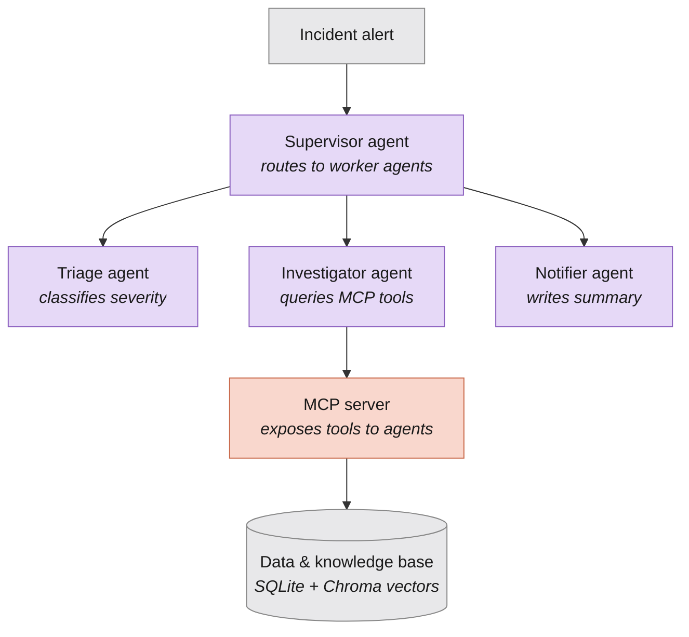

# Incident Commander

A multi-agent incident-response system that simulates how an on-call engineer diagnoses production issues — built to explore how **Model Context Protocol (MCP)**, **RAG**, and **multi-agent orchestration** work together in practice.

When something breaks in production, an engineer normally has to check logs, check metrics, see if this has happened before, and report it. This project hands that workflow to a small team of specialized AI agents, each responsible for one part of the job, coordinated through a custom MCP server.

## How it works

1. **Triage agent** — gets a quick read on severity by checking current metrics. Returns structured JSON, not prose.
2. **Investigator agent** — does the deep work: checks logs, checks metrics, and searches historical runbooks (via RAG) to see if this incident matches something the team has seen before.
3. **Notifier agent** — takes the findings, creates a real incident ticket, and writes a human-readable summary.
4. **Supervisor** — runs all three in sequence, passing each agent's real output into the next.

All four tools the agents use — reading logs, reading metrics, creating tickets, and searching runbooks — are exposed through a single custom **MCP server**, not hardcoded into each agent. Any MCP-compatible agent could plug into the same server without changes.

## Architecture



The Investigator is the only agent that calls all four tools; Triage and Notifier are deliberately scoped narrower. Keeping agent responsibilities explicit (via prompt boundaries) turned out to matter more than expected — an early version had the Investigator creating duplicate tickets because its prompt didn't explicitly rule that out.

## Tech stack

- **Python** — core language throughout
- **MCP Python SDK v2** — the MCP server and tool definitions
- **Google Gemini API** (free tier) — the reasoning behind each agent
- **SQLite** — logs, metrics, and tickets storage
- **ChromaDB + sentence-transformers** — local embeddings and vector search for the RAG runbook layer, fully free and offline
- **MCP Inspector** — used throughout development to test each tool in isolation before wiring up agents

Everything in this project runs on free tiers — no paid infrastructure required to reproduce it.

## Why this design

- **MCP over hardcoded tool calls**: each tool (`get_logs`, `get_metrics`, `create_ticket`, `search_runbooks`) is defined once on the server and discovered dynamically by any agent that connects — no agent-specific tool-calling code duplicated across files.
- **RAG over pure investigation**: the Investigator checks historical runbooks *before* assuming an issue is novel, mirroring how an experienced engineer would first ask "have we seen this before?" rather than always starting from scratch.
- **A hand-written agent loop, not a framework**: the tool-calling loop (`agents/tool_loop.py`) is written from scratch rather than hidden inside an orchestration framework, so every step — listing tools, deciding to call one, executing it, feeding the result back — is visible and understood, not abstracted away.

## Project structure

```
incident-commander/
├── mcp_server/
│   ├── server.py           # MCP server exposing 4 tools
│   ├── db/
│   │   ├── seed.py         # generates fake logs, metrics, tickets table
│   │   └── incidents.db
│   └── rag/
│       ├── build_index.py  # embeds runbooks into Chroma
│       └── chroma_db/
├── knowledge_base/
│   └── runbooks/            # fake historical incident postmortems
├── agents/
│   ├── tool_loop.py         # shared MCP tool-calling loop
│   ├── triage.py
│   ├── investigator.py
│   ├── notifier.py
│   └── supervisor.py        # orchestrates all three agents
├── .env                      # GEMINI_API_KEY (not committed)
└── README.md
```

## Running it locally

```bash
# 1. Set up environment
python3 -m venv venv
source venv/bin/activate
pip install "mcp[cli]" google-genai python-dotenv sentence-transformers chromadb

# 2. Add your Gemini API key (free, no card required, from aistudio.google.com)
echo "GEMINI_API_KEY=your_key_here" > .env

# 3. Seed the fake database
python3 mcp_server/db/seed.py

# 4. Build the RAG index over the runbooks
python3 mcp_server/rag/build_index.py

# 5. Run the full multi-agent pipeline
python3 agents/supervisor.py
```

You can also test the MCP server on its own, independent of any agent, using the MCP Inspector:

```bash
mcp dev mcp_server/server.py
```

## Example output

Running `supervisor.py` against a simulated checkout-service incident produces something like:

```
=== Step 1: Triage ===
{"service": "checkout", "severity": "critical", "reasoning": "..."}

=== Step 2: Investigation ===
[Investigator calls get_logs, get_metrics, and search_runbooks,
 matches the incident to a historical runbook, and produces a
 full root-cause summary]

=== Step 3: Notification ===
[Notifier creates a real ticket and writes a Slack-style alert
 referencing the ticket number]
```


